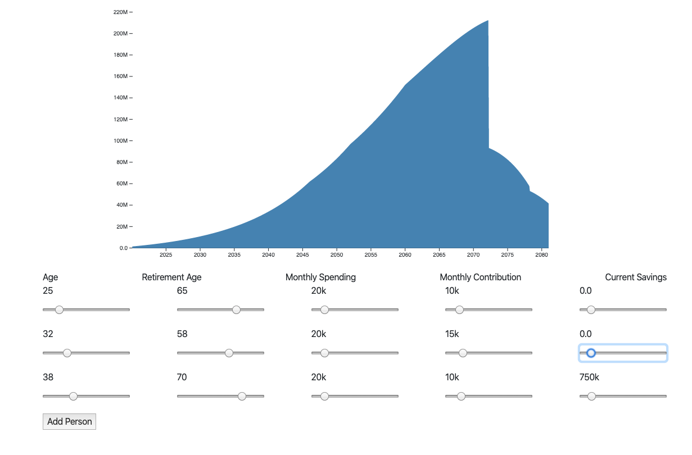

# hack-whale
Joint retirement savings whale chart using D3js and React


## Installation
```
npm i
npm start
```

This is a very rough tool, making some specific assumptions (interest/inflation rates etc.) to show how multiple people can save toward something like retirement.

## Save the whale!

